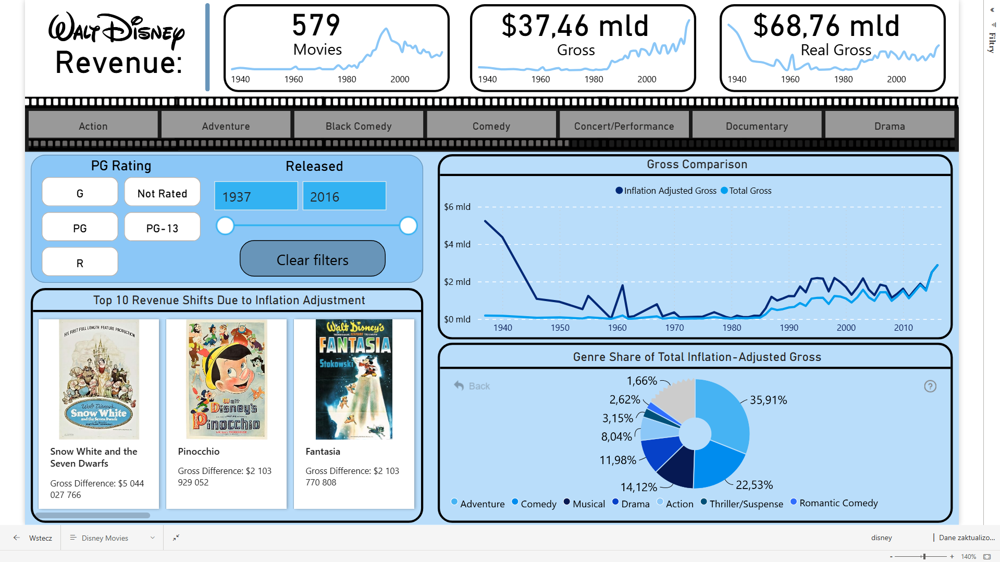

# ENG

# 📊 Disney Movie Revenue Dashboard

### 🔍 Project Overview  
An interactive dashboard built in **Power BI** based on historical revenue data of Disney movies released between **1937 and 2016**. The report was developed as part of an analytics challenge and meets a strict set of **functional and non-functional requirements**.

---

### 📁 Dataset  
- **Source:** Disney movie revenue dataset  
- **Columns:**  
  - `Movie Title`  
  - `Release Date`  
  - `Genre`  
  - `Age Rating`  
  - `Total Revenue`  
  - `Inflation-Adjusted Revenue`

---

### ⚙️ Tools & Technologies  
- **Power BI** (DAX, custom visuals, bookmarks, slicers)  
- **Power Query** for data transformation and API integration  
- **OMDb API integration** for dynamically retrieving movie posters based on title and release year

```powerquery
= (Title as text, Year as nullable date) =>
let
    ApiKey = "APIKEY",
    YearText = if Year <> null then Text.From(Date.Year(Year)) else null,
    BaseUrlWithYear = "http://www.omdbapi.com/?apikey=" & ApiKey & "&t=" & Uri.EscapeDataString(Title) & "&y=" & Uri.EscapeDataString(YearText),
    BaseUrlWithoutYear = "http://www.omdbapi.com/?apikey=" & ApiKey & "&t=" & Uri.EscapeDataString(Title),

    ResponseWithYear = Json.Document(Web.Contents(BaseUrlWithYear)),
    PosterURLWithYear = try ResponseWithYear[Poster] otherwise null,

    ResponseWithoutYear = if PosterURLWithYear = null then Json.Document(Web.Contents(BaseUrlWithoutYear)) else ResponseWithYear,
    PosterURL = try ResponseWithoutYear[Poster] otherwise null
in
    PosterURL
```

### ✅ Features
- Total number of Disney movies  
- Total revenue (with and without inflation adjustment)  
- Genre-based revenue percentage breakdown (excluding "Unknown")  
- Line chart displaying revenue trends over time  
- Top 10 movies ranked by inflation-adjusted revenue difference  
- Filters:  
  - Genre *(multi-select, excludes "Unknown")*  
  - Age Rating *(multi-select, excludes "Unknown")*  
  - Release Year *(multi-range selector)*  
- Dynamic movie posters via OMDb API  
- Movie identification based on title (or title + release year if not unique)

---

### 🧹 Missing Data Handling
- If the selected year has no movie data:  
  - Numerical visuals (cards, charts) return **0** instead of being blank  
  - Movie visuals display `"No Data"` as a placeholder title  
  - Layout remains responsive and informative despite missing data

---

### 🌟 Key Highlights
- Clear data storytelling and responsive design  
- Strong UX/UI principles within a one-page layout  
- Business-focused insights on revenue growth and genre evolution


# PLN

# 📊 Dashboard Przychodów Filmów Disneya

### 🔍 Opis projektu
Interaktywny dashboard stworzony w **Power BI** na podstawie danych o przychodach historycznych filmów Disneya wydanych w latach **1937-2016**. Raport został stworzony w ramach wyzwania analitycznego i spełnia ścisły zestaw **wymagań funkcjonalnych i niefunkcjonalnych**.

---

### 📁 Zbiór danych
- **Źródło:** Zbiór danych o filmach Disneya  
- **Kolumny:**  
  - `Tytuł filmu`  
  - `Data premiery`  
  - `Gatunek`  
  - `Kategoria wiekowa`  
  - `Całkowity przychód`  
  - `Całkowity przychód z uwzględnieniem inflacji`

---

### ⚙️ Narzędzia i technologie
- **Power BI** (DAX, niestandardowe wizualizacje, zakładki, slicery)
- **Power Query** do transformacji danych i integracji z API
- **Integracja z OMDb API** w celu dynamicznego pobierania plakatów filmów na podstawie tytułu i roku premiery

```powerquery
= (Tytul as text, Rok as nullable date) =>
let
    ApiKey = "APIKEY",
    YearText = if Rok <> null then Text.From(Date.Year(Rok)) else null,
    BaseUrlWithYear = "http://www.omdbapi.com/?apikey=" & ApiKey & "&t=" & Uri.EscapeDataString(Tytul) & "&y=" & Uri.EscapeDataString(YearText),
    BaseUrlWithoutYear = "http://www.omdbapi.com/?apikey=" & ApiKey & "&t=" & Uri.EscapeDataString(Tytul),

    ResponseWithYear = Json.Document(Web.Contents(BaseUrlWithYear)),
    PosterURLWithYear = try ResponseWithYear[Poster] otherwise null,

    ResponseWithoutYear = if PosterURLWithYear = null then Json.Document(Web.Contents(BaseUrlWithoutYear)) else ResponseWithYear,
    PosterURL = try ResponseWithoutYear[Poster] otherwise null
in
    PosterURL
```

---

### ✅ Funkcjonalności
- Łączna liczba filmów Disneya
- Łączny przychód (z uwzględnieniem inflacji i bez)
- Udział procentowy przychodu z gatunków filmowych (z wyłączeniem "Unknown")
- Wykres liniowy pokazujący zmiany przychodu w czasie
- Top 10 filmów według różnicy w przychodach z uwzględnieniem inflacji
- Filtry:
  - Gatunek *(wielokrotny wybór, z wyłączeniem "Unknown")*
  - Kategoria wiekowa *(wielokrotny wybór, z wyłączeniem "Unknown")*
  - Rok premiery *(zakres wielokrotnego wyboru)*  
- Dynamiczna integracja plakatów filmów za pomocą OMDb API
- Identyfikacja filmu na podstawie tytułu (lub tytuł + rok premiery, jeśli nieunikatowy)

---

### 🧩 Obsługa brakujących danych
- Jeśli wybrany rok nie zawiera danych o filmach:
  - Wizualizacje numeryczne (np. karty, wykresy) zwracają **0** zamiast pozostawać puste
  - Wizualizacje związane z filmami wyświetlają `"No Data"` jako tytuł zastępczy
  - Układ pozostaje responsywny i informacyjny, nawet przy braku odpowiednich danych

---

### 🌟 Kluczowe obszary
- Jasność wizualizacji danych i responsywność
- Silne zasady UX i UI w układzie na jednej stronie
- Opowiadanie historii biznesowej z naciskiem na wzrost przychodów i dynamikę gatunków filmowych

---

### 🖼️ Podgląd dashboardu
<p align="center">
  
</p>
