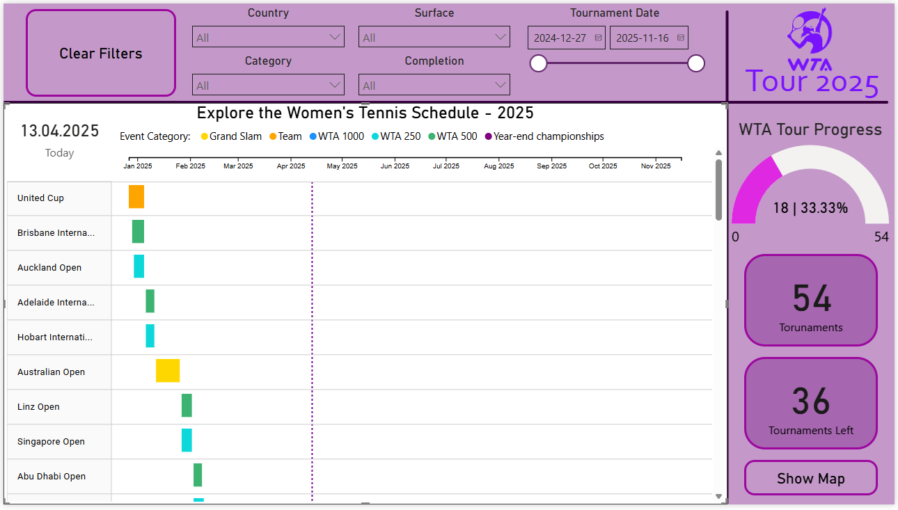
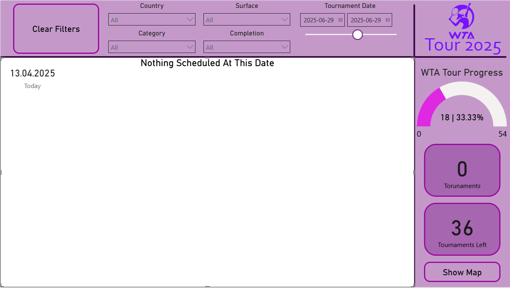
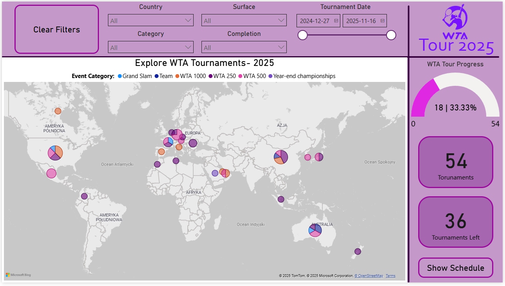

## 📊 WTA Tour Tennis Tournament Dashboard 2025

### 🔍 Projekt
Raport stworzony w **Power BI** na podstawie danych dotyczących turniejów tenisowych WTA Tour, które odbędą się w 2025 roku. Celem raportu jest przedstawienie szczegółowych informacji o nadchodzących turniejach, z uwzględnieniem ich kategorii, lokalizacji, dat oraz nawierzchni.

---

### 📁 Zbiór Danych
- **Źródło:** Zbiór danych turniejów tenisowych WTA Tour 2025  
- **Kolumny:**  
  - `Tournament`: nazwa turnieju  
  - `Category`: kategoria turnieju  
  - `City`: miasto lub miasta, w których odbywa się turniej  
  - `Country`: kraj, w którym odbywa się turniej  
  - `Start Date`: data rozpoczęcia turnieju  
  - `End Date`: data zakończenia turnieju  
  - `Surface`: nawierzchnia, na której rozgrywany jest turniej

---

### ⚙️ Narzędzia i Technologie
- **Power BI** (DAX, niestandardowe wizualizacje, zakładki, filtry)
- **Wizualizacja Gantt** niestandardowa 

---

### ✅ Funkcjonalności
- Liczba zakończonych turniejów w stosunku do wszystkich
- Chronologiczna lista turniejów
- Liczba wierszy odpowiadająca liczbie unikalnych nazw turniejów
- Oś czasu w skali miesięcznej
- Terminarz wyświetlany w pełni na szerokość ekranu
- Aktualny procent ukończenia danego turnieju
- Legenda rozróżniająca turnieje według kategorii
- Informacje o nawierzchni turnieju po najechaniu na niego kursorem
- Filtrowanie danych względem:
  - Kategorii *(wielokrotny wybór)*
  - Kraju *(wielokrotny wybór)*
  - Nawierzchni *(wielokrotny wybór)*
  - Zakresu dat *(jednoczesne uwzględnienie daty rozpoczęcia i zakończenia)*
- Dodatkowe
  - Mapa świata z dokładną lokalizacją turniejów
  - Filtrowanie po Completed
---

### 🧩 Obsługa brakujących danych
- Dane zostają zamienione na `"Not Specified"` (brakujące dane głównie w turnieju billie jean king cup w kwalfiakcjach)
  - Wizualizacje numeryczne (np. karty, wykresy) wyświetlają **0** zamiast pozostawać puste lub pokazywać wartości ujemne
  - Wizualizacje turniejów pokazują `"Nothin Sheduled At This Date"` jako tytuł zastępczy
  - Układ jest responsywny, nawet jeśli brak danych w wybranym zakresie

---

### 🌟 Kluczowe obszary
- Klarowność wizualizacji i responsywność
- Zasady UX i UI w układzie na jednej stronie
- Opowiadanie historii z uwzględnieniem kategorii, lokalizacji i dynamiki turniejów
- Warunki brzegowe przetestowane, gdzie filtr powinien uwzględniać jednocześnie datę rozpoczęcia i datę zakończenia turnieju, tzn. powinny wyświetlić się wszystkie turnieje, których chociaż jeden dzień mieści się w podanym zakresie dat oraz dla daty 29.06.2025 nie ma nic zaplanowanego
---

### 🖼️ Podgląd dashboardu

  

  

  

